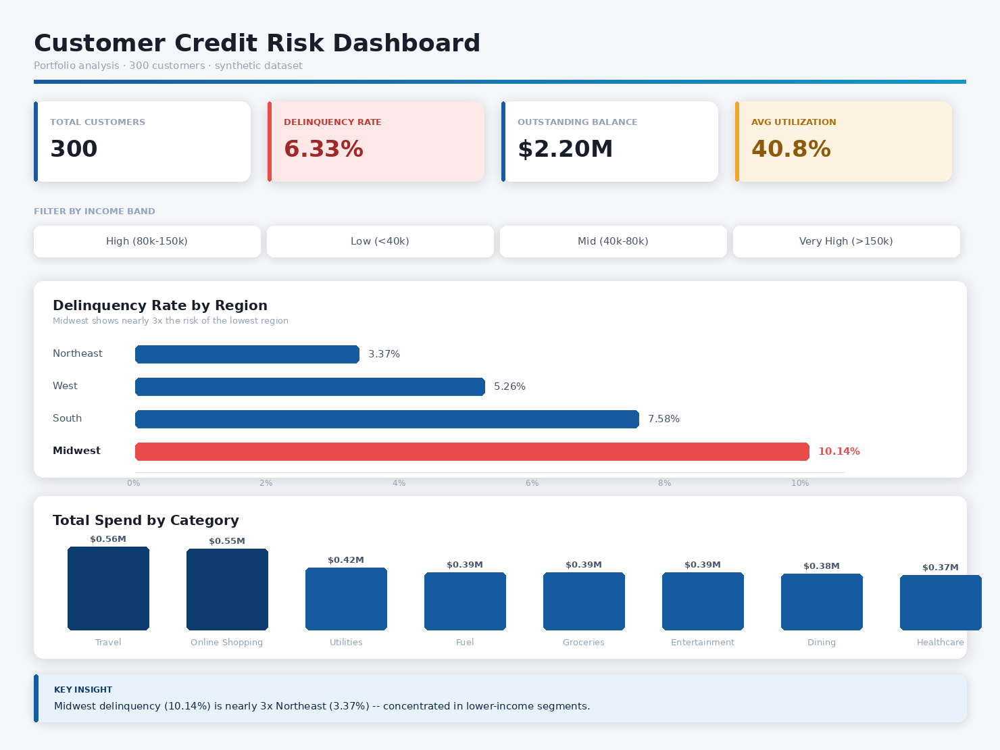

# Customer Credit Risk Dashboard
Power BI dashboard built to identify credit delinquency risk drivers across customer regions, income bands, and spending behavior, supporting proactive credit risk review decisions.

## Business Problem
A credit card issuer needs to identify which customer segments carry the highest risk of delinquency, in order to proactively manage credit exposure before losses occur, rather than reacting after the fact.

## Key Finding
Midwest customers show a **10.14% delinquency rate** — nearly 3x Northeast's 3.37%. Drilling into income bands within Midwest shows this risk is concentrated specifically in **lower-income segments**, indicating that income band, not region alone, is the primary driver of delinquency risk.

## Recommendation
Prioritize credit limit reviews for low-income, high-utilization customers in the Midwest, rather than applying broad regional credit tightening.

## Dashboard

## Approach
- **Data modeling:** Built a customer-level summary table from transaction-level data (SUMMARIZE), separating customer attributes 
  from transaction events to avoid double-counting balances and utilization across repeated rows
- **DAX measures:** Delinquency rate, average utilization, and outstanding balance using CALCULATE, DISTINCTCOUNT, and DIVIDE
- **Data quality:** Verified type consistency (numeric vs text) and validated aggregation logic against row-level vs entity-level granularity before building measures
- **Design:** Conditional formatting to flag the highest-risk region, interactive income-band filtering, consistent visual hierarchy (color-coded KPI cards by risk category)

## Data
Synthetic dataset of 300 customers and ~10,000 transactions, generated to simulate realistic credit card spending and risk patterns across 4 regions and 4 income bands.

## Tools
Power BI Desktop · DAX · Power Query

## Author
Preksha — Data Analyst | [LinkedIn](https://www.linkedin.com/in/preksha-028226201/) | [GitHub](https://github.com/preksha1664)
